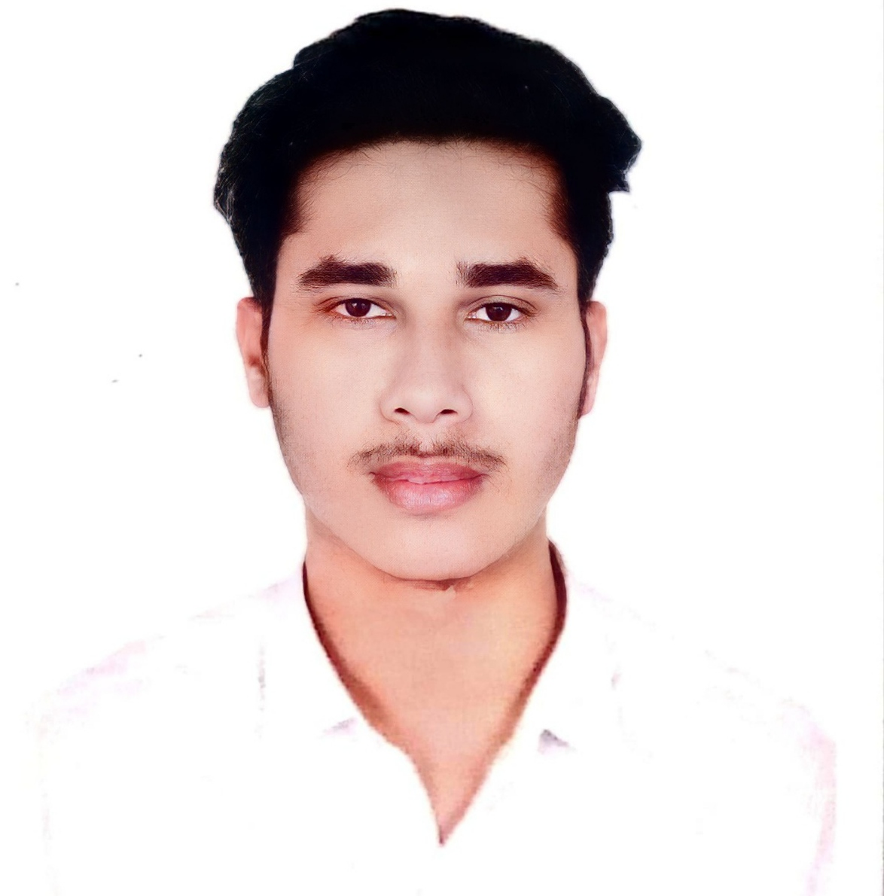

# MD Hasan Sojib

## Project Overview
This documentation provides a detailed guide for the development, structure and maintainance of "MD Hasan Sojib" 's personal portfolio website. The site showcase Sojib's professional information, skills, projects, and contact details in a multi-page layout.

## Directory Structure
The project is organized as follows: 
<pre>
MD Hasan Sojib Portfolio Website/
|
|--- index.html # Home page
|--- about.html # About page
|--- education.html # Education page
|--- skills.html # Skills page
|--- projects.html # Projects page
|--- contant.html # Contact page
|
|--- css/ # CSS files
|   |--- main.css # General styles
|   |--- about.css # About page styles
|   |--- education.css # Education page styles
|   |--- skills.css # Skills page styles
|   |--- projects.css # Projects page styles
|   |--- contact.css # Contact page styles
|
|--- images/ # Image files
|   |--- profile.jpg
|
|--- includes/ # Reusable HTML Components
|   |--- header.html # Header section
|   |---footer.html # Footer section
|   |---nav.html # Navigation bar
|
|___README.md # project documentation
</pre>

## HTML Structure
### index.html
The Home page includes personal info such as 
<pre>
profession title : Frontend Developer
profession description : Professionally i am an student and right now working as a frontend web developer. I make frontend by coding, not using any cms(content management system) right now.

profile picture : 
</pre>

and a call to action.

### about.html
The About Me page details
<pre>
my profession : I am an student and currently completing my BSc degree in Computer Science and Engineering. Also besides my degree, i am working as a junior Frontend Web Developer. 

career objectives : My goal is to solve the problems like small business, startup, entrepreuner's problem and creating website for those who want to start any online services, courses etc. 

personal interest : I am very much interested to become a Full stack web developer and learning new technologies in this field. I am currently learning and exploring Backend technologies like nodjs, mongodb etc. Also i like to explore other technological field like app development, game development and blockchain etc.

about image : 
</pre>

### education.html
The Education page lists my 
<pre>
passing year : 2022
degree : Higher Secondary Certificate
institution name : MEH Arif College

passing year : 2020
degree : Secondary School Certificate
institution name : Agriculture University High School

passing year : 2017
degree : Junior School Certificate
institution name : Agriculture University High School

passing year : 2014
degree : Primary School Certificate
institution name : Bangabandhu Sheikh Mujibur Rahman Agriculture University Primary School
</pre>

### skills.html
The skills page showcase my technical & soft skills like
<pre>
technical skills - 
    HTML
    CSS
    JAVASCRIPT
    GIT

soft skills - 
    Documentation writing
</pre>

## Screen size breakpoints for responsive design
This breakpoint is according to the microsoft screen size breakpoints for responsive design.

* Small : 0-640px
* Medium : 641-1007px
* Large : 1008-up

## Fonts
The whole website contains two fonts. Main font and a secondary font.

-- Root size : 62.5%

* Main font: Poppins
* Secondary font: Poppins

### Optimal Font sizes for large devices

* Body text: 18px (1.8rem)
* Headings: 35px (3.5rem, it should be 1.96 times larger than body text)
* Sub-headings: 30px (3rem)

### Optimal Font sizes for medium devices

* Body text: 17px (1.7rem)
* Headings: 30px (3rem)
* Sub-headings: 25px (2.5rem)

### Optimal Font sizes for small devices

* Body text: 16px (1.6rem)
* Headings: 21px (2.1rem, it should be 1.3 times larger than body text)
* Sub-headings: 18px (1.8rem)